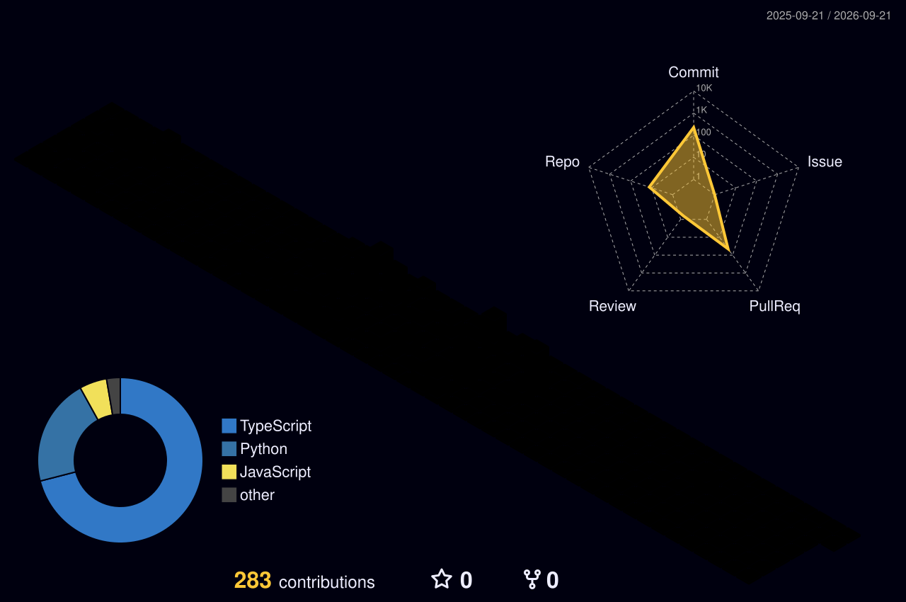

<div align="center">
  
</div>

<div align="center">

[](https://linkedin.com/in/Bodhana23)
[](mailto:jayawickramabodhana@gmail.com)
[](https://github.com/bodhana23?tab=repositories)


</div>

<br/>

## whoami

I build the boring middle of machine learning — the part between a messy CSV and something a person can click. Right now that's pipelines and product code at **Torch Labs**, while finishing my degree at the **University of Kelaniya**.

```python
class Bodhana:
    role     = "Software Engineer Intern @ Torch Labs"
    studying = "University of Kelaniya"
    stack    = ["Python", "TypeScript", "React", "Airflow", "PostgreSQL"]
    learning = ["MLOps", "model deployment", "distributed systems"]

    def open_to(self):
        return ["open-source ML tooling", "developer productivity", "hackathon teams"]
```

<details>
<summary><b>A bit more, if you're curious</b></summary>

<br/>

- 🔬 Most of my work sits in two places: **supervised and unsupervised ML** on real, imperfect data, and **full-stack builds** where that work has to actually ship.
- 🧰 I care more about pipelines that survive a rerun than notebooks that demo well once.
- 🎪 I help organize hackathons and local tech events — usually the person debugging the projector at 2am.
- 📬 The fastest way to reach me is email. I answer.

</details>

---

## Selected work

<table>
<tr>
<td width="50%" valign="top">

**🧪 Donor ML Pipeline**

End-to-end pipeline: ingestion, cleaning, feature engineering, supervised + unsupervised modelling, and tracked evaluation runs.

<sub>`Python` · `scikit-learn` · `Pandas` · `MLflow`</sub>

</td>
<td width="50%" valign="top">

**🧩 CRM Chrome Extension**

Manifest V3 extension that injects a live CRM panel straight into Discord, so records and conversations stop living in two tabs.

<sub>`TypeScript` · `Chrome APIs` · `React`</sub>

</td>
</tr>
<tr>
<td width="50%" valign="top">

**🏆 Hackathon Leaderboard**

Scores participant engagement from submitted social links and ranks teams live during the event.

<sub>`React` · `Node.js` · `PostgreSQL`</sub>

</td>
<td width="50%" valign="top">

**➕ Everything else**

Coursework, experiments, and things that didn't survive contact with a deadline.

<sub>[Browse all repositories →](https://github.com/bodhana23?tab=repositories)</sub>

</td>
</tr>
</table>

---

## Toolkit

<details open>
<summary><b>Languages</b></summary>
<br/>


</details>

<details>
<summary><b>Machine learning & data</b></summary>
<br/>


</details>

<details>
<summary><b>Web, mobile & data stores</b></summary>
<br/>


</details>

<details>
<summary><b>Infrastructure & tooling</b></summary>
<br/>


</details>

---

## By the numbers

<div align="center">

<picture>
  <source media="(prefers-color-scheme: dark)" srcset="https://github-readme-stats.shion.dev/api?username=bodhana23&show_icons=true&hide_border=true&include_all_commits=true&count_private=true&bg_color=0D0B1F&title_color=A277FF&icon_color=61FFCA&text_color=EDECEE" />
  <source media="(prefers-color-scheme: light)" srcset="https://github-readme-stats.shion.dev/api?username=bodhana23&show_icons=true&hide_border=true&include_all_commits=true&count_private=true&title_color=6E40C9&icon_color=1F9C6B&text_color=24292F" />
  
</picture>

<picture>
  <source media="(prefers-color-scheme: dark)" srcset="https://github-readme-stats.shion.dev/api/top-langs/?username=bodhana23&layout=compact&hide_border=true&langs_count=8&count_private=true&bg_color=0D0B1F&title_color=A277FF&text_color=EDECEE" />
  <source media="(prefers-color-scheme: light)" srcset="https://github-readme-stats.shion.dev/api/top-langs/?username=bodhana23&layout=compact&hide_border=true&langs_count=8&count_private=true&title_color=6E40C9&text_color=24292F" />
  
</picture>

<br/><br/>

<picture>
  <source media="(prefers-color-scheme: dark)" srcset="https://streak-stats.demolab.com/?user=bodhana23&hide_border=true&background=0D0B1F&ring=A277FF&fire=FFCA85&currStreakLabel=A277FF&sideLabels=EDECEE&dates=8A87A8&stroke=241E45&currStreakNum=EDECEE&sideNums=EDECEE" />
  <source media="(prefers-color-scheme: light)" srcset="https://streak-stats.demolab.com/?user=bodhana23&hide_border=true&ring=6E40C9&fire=D97706&currStreakLabel=6E40C9" />
  
</picture>

</div>

---

## A year of commits, in 3D

<div align="center">
  
  <br/>
  <sub>Regenerated nightly by GitHub Actions.</sub>
</div>

---

<div align="center">
  <sub>Thanks for scrolling. If something here overlaps with what you're building, my inbox is open.</sub>
</div>